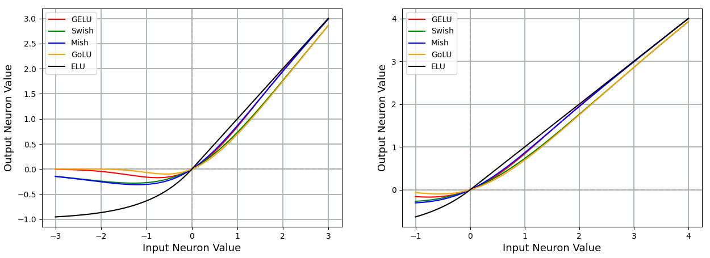
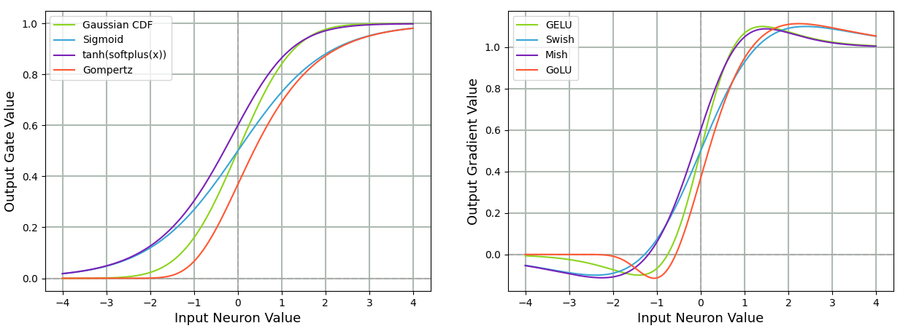
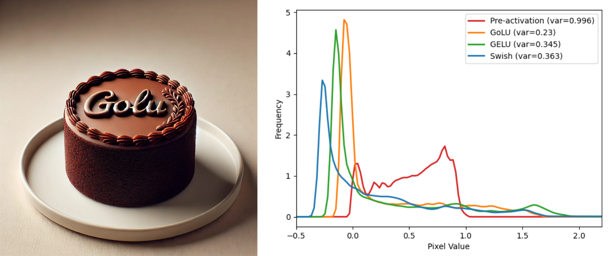
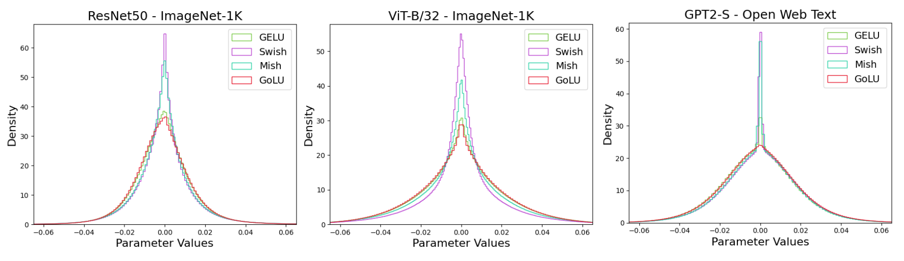

# Gompertz Linear Unit (GoLU) 📊 

[](LICENSE)
[](https://pytorch.org)
[]()
[]()

**Welcome to the official repository of GoLU**

---

GoLU is a novel **self-gated activation function** that enhances neural network performance by leveraging the **Gompertz function** to self-gate the input

$$\text{GoLU}(x) = x \text{} \text{Gompertz}(x) \quad \text{where} \quad \text{Gompertz}(x) = e^{-e^{-x}}$$ 

The Gompertz function is an S-shaped function, similar to the Gaussian CDF and the Sigmoid function, but with distinct properties, notably, a subtle right-skewed asymmetry absent in both the Gaussian CDF and Sigmoid, which are symmetric around a central point. Importantly, the Gompertz function serves as the CDF of the **Standard Gumbel distribution**

$$\text{Gumbel}(x) = e^{-(x + e^{-x})}$$ 

The inherent asymmetry of the Gumbel distribution induces a rightward bias in the Gompertz function, effectively reducing noise and variance in the latent representation due to GoLU’s smaller slope at the origin.

> *"GoLU can be seen as a new standard in activation functions, pushing deep learning performance beyond existing benchmarks!"*

<p align="center">
  
</p>

<p align="center">
  
</p>


## 🏆 Why Choose GoLU?

Unlike ReLU, GELU, Swish or Mish, GoLU offers:

✅ **Reduced activation variance** for better feature representation

<p align="center">
  
</p>

GoLU exhibits a profile that remains close to the x-axis across the input range, indicating a **lower magnitude of slope**, especially near the origin. This property **reduces sensitivity to input variations, minimizing noise and variance in latent representations**. As a result, the activation function produces smoother outputs, improving the model’s ability to distinguish between strong and weak features. Additionally, GoLU demonstrates a **squeezing effect** compressing activation values into a smaller range, further reducing variance compared to other gated activations like GELU and Swish. This effect is clearly evident in this image generated via DALL-E 3 which is later passed viw 3x3 2D Convolution and 2D Batch Normalization and finally through different activation functions. We then plot the distribution of the neuron values in the latent representation to see the effect of GoLU and other activations.

✅ **Smoother loss landscape** encouraging flatter minima  

<p align="center">
  
</p>

GoLU’s smaller gradients contribute to a smoother loss landscape, helping the optimizer avoid sharp variations in parameter space and converge to flatter minima. This property enhances robustness to small perturbations in model parameters, improving generalization. When noise is added to the learned model weights, ResNet-20 with GoLU exhibits a less spiked and more stable loss landscape compared to other activations, suggesting improved resilience to noise. In contrast, ReLU’s non-smooth nature results in a more erratic and highly spiked loss landscape, potentially leading to poorer generalization.

✅ **Spread weight distribution** implying implicit regularization and improved generalization  

<p align="center">
  
</p>

GoLU leads to a broader distribution of learned weights, particularly around the peak, suggesting that networks trained with this activation capture more diverse transformations. This counterbalances the reduced variance in activation outputs, ensuring representational diversity. The broader spread of weights results from more uniform gradients, which encourage a wider distribution while avoiding reliance on extreme parameter values. These findings indicate that GoLU enhances feature differentiation while maintaining balanced weight distribution.

✅ **Strong performance** across diverse Deep Learning tasks - outperforms ReLU, GELU, Swish and Mish 

Below you can find our training results across a wide variety of tasks involving image classification, language modeling, semantic segmentation, object detection, instance segmentation and diffusion.

**Note -** it is not necessary that one activation performs the best across all possible architectures, datasets and hyperparameters settings. We generally observe that at optimal hyperparameter settings GoLU performs the best. Some architectures like ResNet and Vision Transformer already provide ready to use optimal hyperparameter settings and by default GoLU performs better for those. In some cases like Semantic Segmentation using DeepLabV3 trained on MS-COCO and DDPM model trained on the CelebA dataset, we find that the default pipelines are suboptimal. For example, we can reach better performance simply with learning rate ablations over these tasks and datasets.

<details>
<summary><strong>Click to view results</strong></summary>

| Architecture | Dataset | Metric | ReLU | GELU | Swish | Mish | GoLU |
|--------------|---------|--------|------|------|-------|------|------|
| ResNet-18 | ImageNet-1K | Top-1 Acc | 69.74±0.07 | 70.66±0.05 | 70.60±0.06 | 70.53±0.06 | **70.76±0.06** |
| ResNet-34 | ImageNet-1K | Top-1 Acc | 73.26±0.01 | 73.44±0.04 | 72.74±0.05 | 72.73±0.07 | **73.71±0.04** |
| ResNet-50 | ImageNet-1K | Top-1 Acc | 75.44±0.07 | 76.07±0.06 | 75.17±0.14 | 75.53±0.09 | **76.63±0.03** |
| WideResNet-50-2 | ImageNet-1K | Top-1 Acc | 76.96±0.07 | 76.72±0.01 | 75.41±0.03 | 75.75±0.19 | **77.37±0.03** |
| DenseNet-121 | ImageNet-1K | Top-1 Acc | 74.95±0.09 | 74.64±0.11 | 72.81±0.06 | 72.97±0.10 | **75.25±0.03** |
| EfficientNet-B0 | ImageNet-1K | Top-1 Acc | 76.52±0.07 | **76.90±0.01** | 76.84±0.02 | 76.76±0.06 | 76.86±0.04 |
| TinyViT | ImageNet-1K | Top-1 Acc | 82.91±0.02 | 83.05±0.03 | 82.92±0.06 | 83.01±0.02 | **83.21±0.02** |
| ViT-B/32 | ImageNet-1K | Top-1 Acc | 74.51±0.04 | 75.48±0.05 | 72.31±2.15 | 75.16±0.07 | **75.74±0.09** |
| ViT-B/16 | ImageNet-1K | Top-1 Acc | 80.06±0.05 | 79.39±0.99 | 79.19±0.94 | 77.97±1.95 | **80.72±0.04** |
| babyGPT | TinyStories | Perplexity | 4.519±0.006 | 4.462±0.005 | 4.535±0.004 | 4.539±0.007 | **4.444±0.005** |
| babyGPT | TinyStories | Token Acc | 61.243±0.030 | 61.465±0.034 | 61.178±0.032 | 61.135±0.036 | **61.545±0.029** |
| GPT2-S | OpenWebText | Perplexity | 17.845±0.078 | 17.525±0.015 | 17.785±0.026 | 17.797±0.086 | **17.297±0.023** |
| GPT2-S | OpenWebText | Token Acc | 44.059±0.079 | 44.262±0.042 | 44.155±0.025 | 44.104±0.081 | **44.413±0.023** |
| DeepLabV3-RN50 (LR=0.01) | MS-COCO | mIoU | 65.11±0.326 | 65.59±0.162 | 64.14±0.135 | 64.40±0.144 | **65.98±0.124** |
| Faster R-CNN-FPN-RN50 | MS-COCO | Box mAP | 37.44±0.146 | 38.16±0.044 | 37.28±0.078 | 37.71±0.087 | **38.31±0.058** |
| RetinaNet-FPN-RN50 | MS-COCO | Box mAP | 39.90±0.063 | 40.68±0.090 | 40.27±0.087 | 40.45±0.093 | **40.77±0.065** |
| Mask R-CNN-FPN-RN50 | MS-COCO | Box mAP | 38.33±0.001 | **39.00±0.001** | 38.19±0.002 | 38.76±0.000 | 38.96±0.001 |
| Mask R-CNN-FPN-RN50 | MS-COCO | Mask mAP | 34.19±0.001 | **34.73±0.000** | 33.99±0.001 | 34.70±0.000 | 34.54±0.001 |
| DDPM (LR=0.001) | CelebA | Loss | 0.01928±0.0004 | 0.01902±0.0004 | 0.01900±0.0004 | 0.01906±0.0004 | **0.01895±0.0004** |

<br>

The following results can change with re-trainings. However, the activation performance rankings shouldn't change.

</details>
<br>

✅ **CUDA-optimized Kernel** for comparable training and inference speed to PyTorch activations

We leverage the provided CUDA Kernels in [PyTorch](https://github.com/pytorch/pytorch/tree/main/aten/src/ATen/native/cuda) to create our own CUDA-optimized kernel for GoLU. This is done in order to aim for an apples-to-apples comparison across various other activations that already have a CUDA-optimized kernel. We not only focus on delivering a novel activation to the community, but also a well-engineered API that performs at par in terms of training and inference speed with existing activation functions.

<details>
<summary><strong>Click to view kernel speed</strong></summary>

| Architecture | Dataset | Baseline Activation | Relative Training Time | Relative Inference Time |
|-------------|---------|----------------------|------------------------|------------------------|
| ResNet-18 | ImageNet-1k | ReLU | 1.00x | 1.00x |
| ResNet-34 | ImageNet-1k | ReLU | 1.01x | 1.00x |
| ResNet-50 | ImageNet-1k | ReLU | 1.01x | 1.01x |
| WideResNet-50-2 | ImageNet-1k | ReLU | 1.03x | 1.02x |
| DenseNet121 | ImageNet-1k | ReLU | 1.02x | 1.02x |
| EfficientNet-B0 | ImageNet-1k | Swish | 1.00x | 1.00x |
| TinyViT | ImageNet-1k | GELU | 0.99x | 0.98x |
| ViT-B/32 | ImageNet-1k | GELU | 0.99x | 0.99x |
| ViT-B/16 | ImageNet-1k | GELU | 0.98x | 0.98x |
| babyGPT | TinyStories | GELU | 1.00x | 1.00x |
| GPT2-S | OpenWebText | GELU | 1.01x | 1.01x |
| DeepLabV3-RN50 | MS-COCO | ReLU | 1.14x | 1.04x |
| Faster R-CNN-FPN-RN50 | MS-COCO | ReLU | 1.03x | 1.00x |
| RetinaNet-FPN-RN50 | MS-COCO | ReLU | 1.00x | 1.00x |
| Mask R-CNN-FPN-RN50 | MS-COCO | ReLU | 1.05x | 1.02x |
| DDPM | CelebA | Swish | 0.97x | 0.97x |
| **Average** | - | - | **1.01x** | **1.00x** |

</details>
<br>

---

## 🛠️ Installation (Linux)

Follow these steps to set up GoLU.

### 1️⃣ Install Conda

Ensure that Conda is installed on your system. If not, you can install it by running:

```bash
wget https://repo.anaconda.com/miniconda/Miniconda3-latest-Linux-x86_64.sh
bash ~/Miniconda3-latest-Linux-x86_64.sh
source ~/.bashrc
```

### 2️⃣ Clone the Repository

Next, clone the GoLU repository:

```bash
git clone <fill_this_later>
cd GoLU
```

### 3️⃣ Install Dependencies

Finally, install all the required packages:

```bash
conda create -n golu_env python=3.10 -y
conda activate golu_env
pip install -r requirements.txt
```
In case torch, torchvision and torchaudio doesn't install via the requirements.txt file, use the following command:

```bash
pip install torch torchvision torchaudio --index-url https://download.pytorch.org/whl/cu121
```

### 4️⃣ Install GCC Compiler (optional)

If Linux already has GCC Compiler, you don't need this. The GCC compiler helps compile the CUDA Kernel before use. To install GCC, you can use the following command:

```bash
conda install -c conda-forge gcc=9 gxx=9
```

Set the following environment variables

```bash
export CC=$(which gcc)
export CXX=$(which g++)
```


## 📌 Usage

Using GoLU is simple! You can import and use it directly in your PyTorch model.

We simply compile the CUDA kernel on the fly while running any script that uses it. 

```python
from torch.utils.cpp_extension import load

# Exists in golu_cuda_activation.py
golu_extension = load(
    name="golu_extension",
    sources=["./golu/golu_cuda_kernel.cu", "./golu/golu_cuda.cpp"],
    extra_cflags=["-O3"],
    extra_cuda_cflags=["--use_fast_math", "--extended-lambda"],
    verbose=True
)
```

### 1️⃣ Import GoLUCUDA Activation

```python
from golu.golu_cuda_activation import GoLUCUDA
activation = GoLUCUDA()
```

### 2️⃣ Use GoLU in a Model

```python
import torch
import torch.nn as nn
from golu.golu_cuda_activation import GoLUCUDA

class SampleModel(nn.Module):
    def __init__(self):
        super(SampleModel, self).__init__()
        self.fc = nn.Linear(128, 128)
        self.activation = GoLUCUDA()
    
    def forward(self, x):
        x = self.fc(x)
        x = self.activation(x)
        return x

# Example usage
model = SampleModel()
model.to('cuda')
x = torch.randn(1, 128).to('cuda')
y = model(x)
print(y)
```

### 3️⃣ Get Activation by Name

You can also fetch any activation function dynamically by passing its name as a string:

```python
from golu.activation_utils import get_activation_function

# Check get_activation_function() for available activation functions
activation_function = get_activation_function(activation='GoLUCUDA')
```

If you need to replace an existing activation in a model:

```python
import torchvision
from golu.activation_utils import replace_activation_by_torch_module

# replace_activation_by_torch_module() recursively replaces any instance of nn.ReLU in the model with the activation of choice
model = torchvision.models.get_model("resnet50", weights=None, num_classes=1000)
model = replace_activation_by_torch_module(model, nn.ReLU, activation)
model.to('cuda')
```

### 4️⃣ Modify GoLU Parameters

You can update the GoLU activation parameters dynamically:

```python
from golu.activation_utils import update_golu_parameters
model = update_golu_parameters(model, new_alpha=0.8, new_beta=1.2, new_gamma=0.9)
```

However, please don't set these parameters in the activation to negative values. This could lead the Gompertz function to lose its characteristic S-Shape. Also, this can be done only when the model has an instance of GoLUCUDA in it.


### 5️⃣ Commands

Below you can find the commands for training and plotting. **Note -** the commands are mostly simple and easy to alter. Therefore, anybody willing to contribute better pipelines for each of these tasks is free to do so. You can play around with the command line arguments and do ablations of your choice that could lead to improved results.

<details>
<summary><strong>Click to view</strong></summary>

**Note -** For all our trainings we usually store results in a folder like "./results" and many of our scripts have this hard-coded. This means that the $RESULTS_PATH folder equals "./results". In case you get path errors, you could change the code to the path you've used, otherwise please feel free to stick to "./results".

<details>
<summary><strong>Image Classification</strong></summary>

### ImageNet-1K

#### Setting up the dataset

To setup the dataset one needs to register [here](https://image-net.org/index.php). After registering successfully download the following dataset files.

Go to this [link](https://image-net.org/challenges/LSVRC/2012/2012-downloads.php) and download the **Training images (Task 1 & 2)**-138GB, **Validation images (all tasks)**-6.3GB and **Development kit (Task 1 & 2)**-2.5MB files. **After downloading them do not unzip as the ImageNet class from TorchVision does that for you.** Also, when unzipping it, make sure you have only one task with multiple CPU workers to expedite the unzipping process. You can use the following command to prepare the dataset for training.

Note to change the $NUM_WORKERS and $DATA_PATH. The zip/tar files should be present in the "$DATA_PATH/imagenet_1k" directory for it to unzip the data.

```bash
srun --ntasks=1 --cpus-per-task=$NUM_WORKERS python -m tasks.image_classification.setup_dataset --dataset_path $DATA_PATH
```

#### ResNets 18, 34 and 50

Change --nproc_per_node=4 depending on the number of available GPUs. Further, change $NUM_WORKERS, $RESULTS_PATH, $DATA_PATH, $ACTIVATION and $SEED accordingly. $MODEL_NAME can be either **"resnet18"**, **"resnet34"** or **"resnet50"**. In this, --batch-size is the overall batch size which is further handled by --gradient-accumulation-steps and world_size in the code depending on the number of GPUs and the accumulation steps passed in the arguments.

```bash
torchrun --standalone --nproc_per_node=4 -m tasks.image_classification.train --workers $NUM_WORKERS --output-dir $RESULTS_PATH --data-path "$DATA_PATH/imagenet_1k" --model $MODEL_NAME --activation $ACTIVATION --seed $SEED --sync-bn
```

#### WideResNet-50-2 and DenseNet-121

Change --nproc_per_node=4 depending on the number of available GPUs. Further, change $NUM_WORKERS, $RESULTS_PATH, $DATA_PATH, $ACTIVATION and $SEED accordingly. $MODEL_NAME can be either **"wide_resnet50_2"** or **"densenet121"**. In this, --batch-size is the overall batch size which is further handled by --gradient-accumulation-steps and world_size in the code depending on the number of GPUs and the accumulation steps passed in the arguments.

```bash
torchrun --standalone --nproc_per_node=4 -m tasks.image_classification.train --workers $NUM_WORKERS --output-dir $RESULTS_PATH --data-path "$DATA_PATH/imagenet_1k" --model $MODEL_NAME --activation $ACTIVATION --seed $SEED --opt "sgd_nesterov" --sync-bn
```

#### EfficientNet-B0

Change --nproc_per_node=4 depending on the number of available GPUs. Further, change $NUM_WORKERS, $RESULTS_PATH, $DATA_PATH, $ACTIVATION and $SEED accordingly. In this, --batch-size is the per gpu batch size.

```bash
torchrun --standalone --nproc_per_node=4 -m tasks.image_classification.timm_training_script --output $RESULTS_PATH --dataset "torch/imagenet" --data-dir "$DATA_PATH/imagenet_1k" --seed $SEED --activation $ACTIVATION --model "efficientnet_b0" --batch-size 384 --sched "step" --epochs 450 --decay-epochs 2.4 --decay-rate 0.97 --opt "rmsproptf" --opt-eps 0.001 --workers $NUM_WORKERS --warmup-lr 1e-6 --weight-decay 1e-5 --drop 0.2 --drop-connect 0.2 --model-ema --model-ema-decay 0.9999 --aa "rand-m9-mstd0.5" --remode "pixel" --reprob 0.2 --amp --lr 0.048
```

#### Tiny-ViT

Change --nproc_per_node=4 depending on the number of available GPUs. Further, change $RESULTS_PATH, $DATA_PATH, $ACTIVATION and $SEED accordingly. In this, --batch-size is the per gpu batch size.

```bash
torchrun --standalone --nproc_per_node=4 -m tasks.image_classification.tiny_vit.main --cfg "./tasks/image_classification/tiny_vit/configs/1k/tiny_vit_21m.yaml" --data-path "$DATA_PATH/imagenet_1k" --batch-size 256 --seed $SEED --run-name $ACTIVATION --act $ACTIVATION --output "$RESULTS_PATH/$ACTIVATION/$SEED"
```

#### ViT-B/32 and ViT-B/16

Change --nproc_per_node=4 depending on the number of available GPUs. This will further change --gradient-accumulation-steps in the command. For overall batch size of 4096, --gradient-accumulation-steps=8 and world_size=4, the batch size per gpu is 128. Further, change $NUM_WORKERS, $RESULTS_PATH, $DATA_PATH, $ACTIVATION and $SEED accordingly. $MODEL_NAME can be either **"vit_b_32"** or **"vit_b_16"**

```bash
torchrun --standalone --nproc_per_node=4 -m tasks.image_classification.train --workers $NUM_WORKERS --output-dir $RESULTS_PATH --data-path "$DATA_PATH/imagenet_1k" --model $MODEL_NAME --activation $ACTIVATION --seed $SEED --epochs 300 --batch-size 4096 --gradient-accumulation-steps 8 --opt "adamw" --lr 0.003 --wd 0.3 --lr-scheduler "cosineannealinglr" --lr-warmup-method "linear" --lr-warmup-epochs 30 --lr-warmup-decay 0.033 --amp --label-smoothing 0.11 --mixup-alpha 0.2 --cutmix-alpha 1.0 --auto-augment "imagenet" --clip-grad-norm 1.0 --ra-sampler --model-ema
```

### CIFAR-10

#### ResNets 20, 32, 44, 56, 110, WideResNet-28-2, DenseNet-40

Change $MODEL_NAME, $RESULTS_PATH, $ACTIVATION and $SEED accordingly. $MODEL_NAMES can be "resnet20", "resnet32", "resnet44", "resnet56", "resnet110", "wideresnet_28_2", "densenet_40".

```bash
python -m tasks.small_poc.main --model $MODEL_NAME --activation $ACTIVATION --seed $SEED --results_path $RESULTS_PATH
```

#### ViT-Ti/16-224

```bash
python -m tasks.small_poc.train_vit --model "vit_tiny_patch16_224" --dataset "torch/CIFAR10" --workers 1 --data-dir "./data" --dataset-download --drop 0.0 --drop-path 0.1 --warmup-epochs 20 --weight-decay 0.05 --lr-base 5e-4 --warmup-lr 5e-7 --min-lr 5e-6 --clip-grad 5 --layer-decay 1.0 --decay-epochs 30 --opt "adamw" --opt-eps 1e-8 --opt-betas 0.9 0.999 --aa "rand-m9-mstd0.5-inc1" --reprob 0.25 --mixup 0.8 --cutmix 1.0 --batch-size 32 --epochs 300 --seed $SEED --ac $ACTIVATION --results_folder $RESULTS_PATH 
```

### Small Ablations - CIFAR-10 and MNIST

#### For MNIST:

```bash
python -m tasks.small_poc.run_small_ablation --dataset mnist
```

#### For CIFAR-10:

```bash
python -m tasks.small_poc.run_small_ablation --dataset cifar10
```

#### To generate the loss contours, --dataset could be "mnist" or "cifar10":

```bash
python -m tasks.small_poc.merge_and_plot_contours --dataset cifar10
```

#### To generate the learning rate heatmaps, --dataset could be "mnist" or "cifar10":

```bash
python -m tasks.small_poc.lr_heatmaps --dataset cifar10
```

</details>


<details>
<summary><strong>Language Modeling</strong></summary>

### babyGPT - TinyStories

First prepare the Tiny Stories dataset - change $DATA_DIR and $NUM_WORKERS accordingly.

```bash
python -m tasks.gpt.prepare_tiny_stories --cache_dir "$DATA_DIR/tiny_stories" --num_workers $NUM_WORKERS
```

Change $DATA_PATH, $SEED, $ACTIVATION, $RESULTS_PATH and $INIT_FROM accordingly.

When training for the first time $INIT_FROM should be "scratch", while when resuming training $INIT_FROM should be "resume". Also, the $DATA_PATH in the code becomes $DATA_PATH/dataset i.e. if $DATA_PATH="./data" and dataset="tiny_stories", then the path becomes "./data/tiny_stories" in the code automatically. You explicitly need not append tiny_stories at the end while exporting DATA_PATH.

Also, when --nproc_per_node=4 changes based on the number of available GPUs, make sure you check the ./tasks/gpt/config/train_baby_gpt_tiny_stories.py file for any changes.

```bash
torchrun --standalone --nproc_per_node=4 -m tasks.gpt.train --model_name "baby_gpt" --dataset "tiny_stories" --dataset_path $DATA_PATH --seed $SEED --activation $ACTIVATION --results_path $RESULTS_PATH --init_from $INIT_FROM --max_iters 10000 --lr_decay_iters 10000
```

### GPT2-S - OpenWebText

First prepare the OpenWebText dataset - change $DATA_DIR and $NUM_WORKERS accordingly.

```bash
python -m tasks.gpt.prepare_owt --cache_dir "$DATA_DIR/open_web_text" --num_workers $NUM_WORKERS
```

Change $DATA_PATH, $SEED, $ACTIVATION, $RESULTS_PATH and $INIT_FROM accordingly.

When training for the first time $INIT_FROM should be "scratch", while when resuming training $INIT_FROM should be "resume". Also, the $DATA_PATH in the code becomes $DATA_PATH/dataset i.e. if $DATA_PATH="./data" and dataset="open_web_text", then the path becomes "./data/open_web_text" in the code automatically. You explicitly need not append open_web_text at the end while exporting DATA_PATH.

Also, when --nproc_per_node=4 changes based on the number of available GPUs, make sure you check the ./tasks/gpt/config/train_gpt2s_open_web_text.py file for any changes.

```bash
torchrun --standalone --nproc_per_node=4 -m tasks.gpt.train --model_name "gpt2s" --dataset "open_web_text" --dataset_path $DATA_PATH --seed $SEED --activation $ACTIVATION --results_path $RESULTS_PATH --init_from $INIT_FROM --max_iters 600000 --lr_decay_iters 600000
```

</details>


<details>
<summary><strong>Semantic Segmentation</strong></summary>

### DeepLabV3 ResNet-50 - MS-COCO

Download the dataset before training the model. Follow the commands below,

Training Dataset

```bash
wget http://images.cocodataset.org/zips/train2017.zip
```

Validation Dataset

```bash
wget http://images.cocodataset.org/zips/val2017.zip
```

Annotations

```bash
wget http://images.cocodataset.org/annotations/annotations_trainval2017.zip
```

Unzip the files

```bash
unzip train2017.zip
unzip val2017.zip
unzip annotations_trainval2017.zip
```

Training command - Change --nproc_per_node=4 according to the number of available GPUs. --batch_size here is per GPU. --backbone-checkpoint-path uses the pre-trained checkpoints of ResNet50 on ImageNet-1K. It selects the checkpoint as per the activation and seed combination.

Set the $NUM_WORKERS, $DATA_PATH, $RESULTS_PATH, $SEED and $ACTIVATION accordingly. You can simply change --lr to do a learning rate ablation.

```bash
torchrun --standalone --nproc_per_node=4 -m tasks.semantic_segmentation.train --model "deeplabv3_resnet50" --output-dir $RESULTS_PATH --workers $NUM_WORKERS --seed $SEED --activation $ACTIVATION --dataset "coco" --data-path $DATA_PATH --backbone-checkpoint-path "$RESULTS_PATH/imagenet_1k/resnet50" --lr 0.02 --batch-size 8 --aux-loss "True" --print-freq 100 
```

</details>


<details>
<summary><strong>Object Detection</strong></summary>

### Faster R-CNN-FPN ResNet-50 - MS-COCO

Follow the process to download the data as per **DeepLabV3 ResNet-50 - MS-COCO**.

Training command - Change --nproc_per_node=4 according to the number of available GPUs. --batch_size here is per GPU. --backbone-checkpoint-path uses the pre-trained checkpoints of ResNet-50 on ImageNet-1K. It selects the checkpoint as per the activation and seed combination.

Set the $NUM_WORKERS, $DATA_PATH, $RESULTS_PATH, $SEED and $ACTIVATION accordingly. You can simply change --lr to do a learning rate ablation.

```bash
torchrun --standalone --nproc_per_node=4 -m tasks.object_detection.train --model "fasterrcnn_resnet50_fpn" --output-dir $RESULTS_PATH --workers $NUM_WORKERS --seed $SEED --activation $ACTIVATION --dataset "coco" --data-path $DATA_PATH --batch-size 4 --lr 0.02 --epochs 26 --lr-steps 16 22 --aspect-ratio-group-factor 3 --print-freq 100 --backbone-checkpoint-path "$RESULTS_PATH/imagenet_1k/resnet50"
```

### RetinaNet-FPN ResNet-50 - MS-COCO

Follow the process to download the data as per **DeepLabV3 ResNet-50 - MS-COCO**.

Training command - Change --nproc_per_node=4 according to the number of available GPUs. --batch_size here is per GPU. --backbone-checkpoint-path uses the pre-trained checkpoints of ResNet-50 on ImageNet-1K. It selects the checkpoint as per the activation and seed combination.

Set the $NUM_WORKERS, $DATA_PATH, $RESULTS_PATH, $SEED and $ACTIVATION accordingly. You can simply change --lr to do a learning rate ablation.

```bash
torchrun --standalone --nproc_per_node=4 -m tasks.object_detection.train --model "retinanet_resnet50_fpn_v2" --output-dir $RESULTS_PATH --workers $NUM_WORKERS --seed $SEED --activation $ACTIVATION --dataset "coco" --data-path $DATA_PATH --batch-size 4 --lr 0.0001 --weight-decay 0.05 --norm-weight-decay 0.0 --opt adamw --epochs 26 --lr-steps 16 22 --aspect-ratio-group-factor 3 --data-augmentation "multiscale" --print-freq 100 --backbone-checkpoint-path "$RESULTS_PATH/imagenet_1k/resnet50"
```

</details>


<details>
<summary><strong>Instance Segmentation</strong></summary>

### Mask R-CNN-FPN ResNet-50 - MS-COCO

Follow the process to download the data as per **DeepLabV3 ResNet-50 - MS-COCO**.

Training command - Change --nproc_per_node=4 according to the number of available GPUs. --batch_size here is per GPU. --backbone-checkpoint-path uses the pre-trained checkpoints of resnet50 on ImageNet-1K. It selects the checkpoint as per the activation and seed combination. You can simply change --lr to do a learning rate ablation.

Set the $NUM_WORKERS, $DATA_PATH, $RESULTS_PATH, $SEED and $ACTIVATION accordingly.

```bash
torchrun --standalone --nproc_per_node=4 -m tasks.instance_segmentation.train --model "maskrcnn_resnet50_fpn" --output-dir $RESULTS_PATH --workers $NUM_WORKERS --seed $SEED --activation $ACTIVATION --dataset "coco" --data-path $DATA_PATH --batch-size 4 --lr 0.02 --epochs 26 --lr-steps 16 22 --aspect-ratio-group-factor 3 --print-freq 100 --backbone-checkpoint-path "$RESULTS_PATH/imagenet_1k/resnet50"
```

</details>


<details>
<summary><strong>Diffusion</strong></summary>

### Denoising Diffusion Probabilistic Model - CelebA

Download the dataset before training the model - set $DATA_PATH accordingly. Downloading during training may cause the 
data to get corrupted as all processes start downloading the same. Hence, it's better to download it once when not
doing Distributed Data Parallel.

```python
from torchvision.datasets import CelebA

train_dataset = CelebA(root=$DATA_PATH, split="train", download=True)
valid_dataset = CelebA(root=$DATA_PATH, split="valid", download=True)
```

Set the $NUM_WORKERS, $RESULTS_PATH, $DATA_PATH, $SEED and $ACTIVATION accordingly. Also change --nproc_per_node=4 
according to the number of available GPUs. You can simply change --lr to do a learning rate ablation.

```bash
torchrun --standalone --nproc_per_node=4 -m tasks.diffusion.train_ddp --num_workers $NUM_WORKERS --save_dir $RESULTS_PATH --data_dir $DATA_PATH --seed $SEED --activation $ACTIVATION
```

</details>


<details>
<summary><strong>Visualizations</strong></summary>

For any visualizations in the ./visualizations folder you can simply run a command as follows.

```bash
python -m visualizations.<folder_name>.<file_name>
```

A simple example is as follows,

```bash
python -m visualizations.activations.activation_visualizations
```

Similarly, you can run the rest of visualizations too.

</details>

</details>

<br>

🚀 Now you're ready to integrate **GoLU** into your deep learning models!


## Cite GoLU

Please cite GoLU in case you use it in your work 🙌

```bibtex
@article{TBD,
  title={TBD},
  author={TBD},
  year={TBD}
}
```
